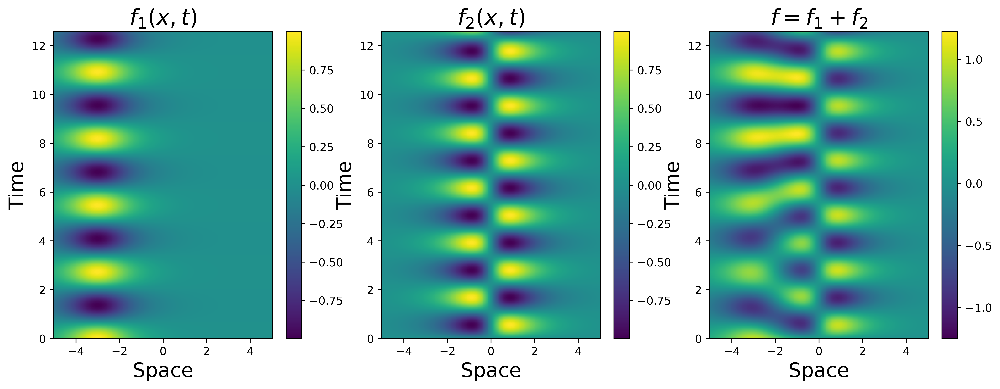
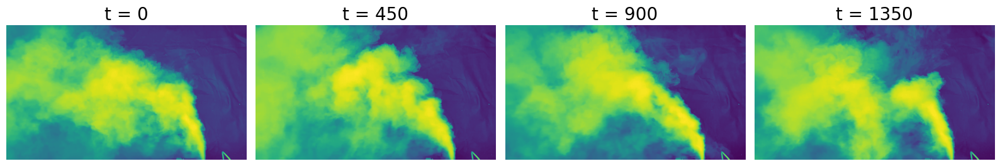

Experiments and results will be stored in `pydmdeep` package.
# Data
Currently two different datasets are being used for benchmarking and experiments.
- A toy_dataset of overlapping spatial modes with differing frequencies, which can be generated from `pydmdeep.data.generate_toy_dataset()`. Couresty of the [PyDMD github tutorials](https://github.com/PyDMD/PyDMD/blob/master/tutorials/tutorial1/tutorial-1-dmd.ipynb).
- An *unpublished* Plumes video dataset captured with a highspeed camera. Dataset is hosted on local server.


# Figures and Plots
All figures used for paper (and related documents, *e.g.*, project proposal) will be found in the `pydmdeep.post` subpackage.

## MWE: producing figures
To construct all figures simply run
```python
import pydmdeep.post as post
post.run()
```

Or run specific post submodules for specific figures, _i.e._,
```python
post.propsal_figures.run()
```




# Pytorch
For setting up pytorch on Matrix or Vector, execute
```console
pip3 install torch torchvision torchaudio
```

For other local/remote installations follow guide at [pytorch installation guide](https://pytorch.org/get-started/locally/).
